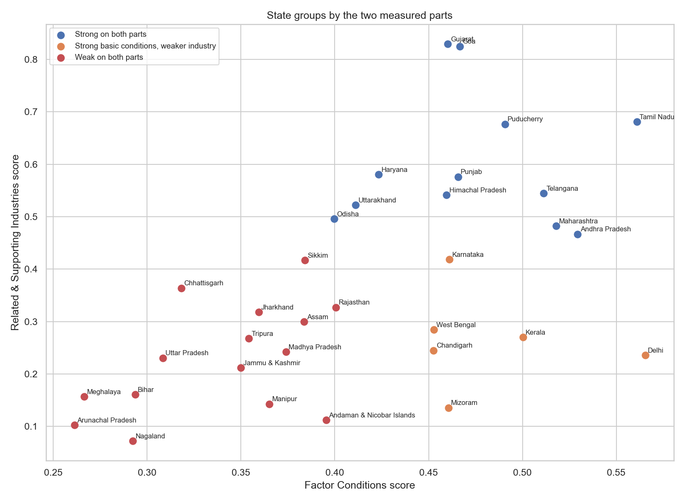

# State Clustering
India State Competitiveness Index (ISCI) — Version 2.0

**Research question:** Can states be grouped into similar types using their scores?

The groups are made only from the two measured parts: Factor Conditions and Related &
Supporting Industries. Clustering does not use geography, population or income. So the
groups come from the data, not from any list decided in advance.

How the groups were made:

We used a method called K-means, which puts states with similar scores into the same
group. Both parts are put on the same scale first, so one does not dominate.

We tried 2, 3, 4 and 5 groups. Two groups gave the highest statistical score. Three groups
gave a slightly lower score, but it separated the states into three clear and
easy-to-understand types. Because this report aims to explain the results, we chose three
groups.

## The three groups

| Group | States | Avg basic conditions | Avg industry | Avg score | Avg rank |
|-------|:------:|:--------------------:|:------------:|:---------:|:--------:|
| Strong on both parts | 12 | 0.48 | 0.60 | 0.52 | 6.7 |
| Strong basic conditions, weaker industry | 6 | 0.48 | 0.27 | 0.40 | 16.5 |
| Weak on both parts | 15 | 0.34 | 0.23 | 0.30 | 25.5 |

### Strong on both parts (12)

Goa, Tamil Nadu, Gujarat, Puducherry, Telangana, Andhra Pradesh, Punjab, Maharashtra,
Himachal Pradesh, Haryana, Uttarakhand, Odisha.

These states score well on both parts, and best on industry. They fill the top of the
ranking, with an average rank near 7.

### Strong basic conditions, weaker industry (6)

Karnataka, Delhi, Kerala, West Bengal, Chandigarh, Mizoram.

These states have good basic conditions but low industry scores. They sit in the middle of
the ranking, with an average rank near 17.

### Weak on both parts (15)

Sikkim, Rajasthan, Assam, Jharkhand, Chhattisgarh, Madhya Pradesh, Tripura, Jammu &
Kashmir, Uttar Pradesh, Manipur, Andaman & Nicobar Islands, Bihar, Meghalaya, Nagaland,
Arunachal Pradesh.

These states score low on both parts. They fill the bottom of the ranking, with an average
rank near 26.

## Scatter plot

Each point is one state. States with similar scores are placed in the same group.

## What we learn

The middle group stands out. Its basic-conditions score (0.48) is about the same as the
top group (0.48). But its industry score is much lower (0.27 against 0.60). So the only
real difference between the top group and the middle group is industry.

The weak group is low on both parts, not just one.

No group has weak basic conditions and strong industry.

## Questions for the next notebook

- How far is each state from the top group?
- What would each state need to improve to move up?
- Which numbers hold each state back the most?
- Which gap is easiest for each state to reduce?

The next notebook measures these gaps.
